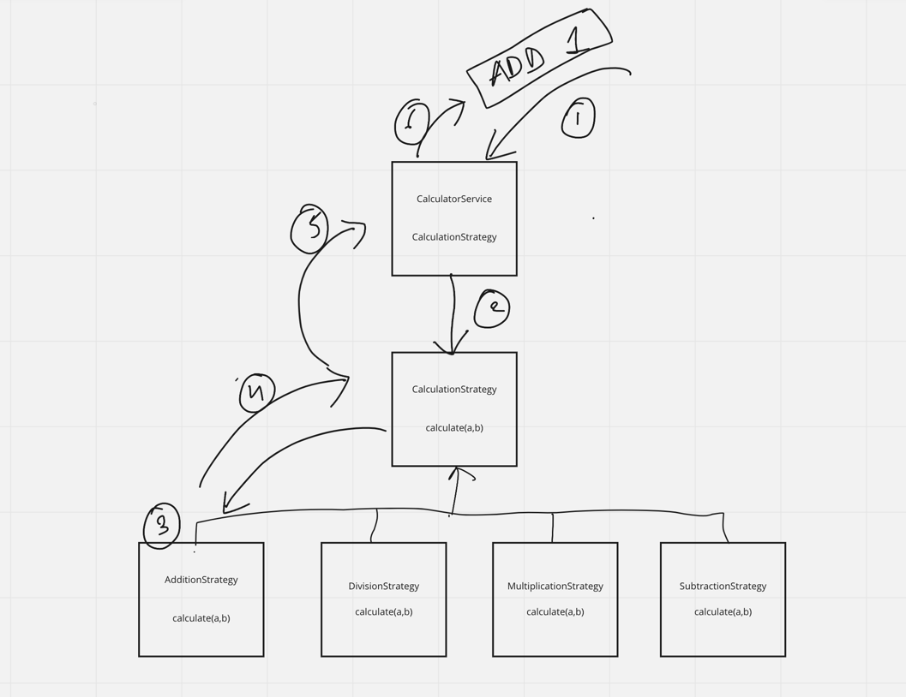

# Calculator Low Level Design

## Problem Statement:

Design a standalone calculator which take instructions as input from command line such as below:

ADD 1  ADD 2   SUB 3   DIV 4   MUL 10   DIV 10

Currently, the calculator only Supports ADD, SUB, MUL, DIV but design should also consider for extensibility.

## Requirement Gathering/ Requirement Analysis

- What should be the behaviour when calculator receives invalid input?
- Does it only accepts Integer as Input, or it can accept float as well?
- Can it support operations like SQRT, SIN, COS calculations?
- Will it also support multiple Format's such as **ADD 1  MUL 4 DIV 1**

## Design Pattern used and Why?

I preferred Strategy Design Pattern for the implementation because:

- For each Operator type there is a separate strategy to calculate.
- Strategy design pattern will reduce number of if-else blocks thus support **CLOSE** principle of SOLID.
- With strategy pattern we make room of extensibility for newer type of Operators such as SIN, COS, SQRT etc thus support **OPEN** principle for SOLID

Read [here](https://en.wikipedia.org/wiki/Strategy_pattern) more about strategy design pattern.

