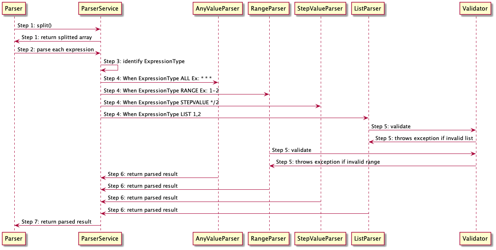

# cron expression Parser


## Develop

mvn clean install

###entry point of execution is Main class

```
public static void main(String[] args) {
List<String> cronExpressions =
Arrays.asList(new String[]{"*/15 0 1,15 * 1-5 /usr/bin/find"});
final Parser parser = new Parser(new ParserService());
cronExpressions.forEach(cronExpression -> {
System.out.println(":::::::::::::::STARTED PARSING:::::::::::::::::::::::::::");
parser.parse(cronExpression).forEach((K, V) -> System.out.println(K + " " + V));
System.out.println(":::::::::::::::FINISHED PARSING:::::::::::::::::::::::::::");
});
}
```

###code flow

